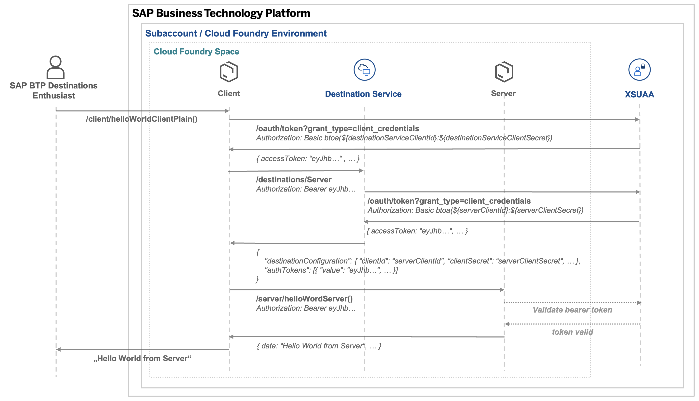
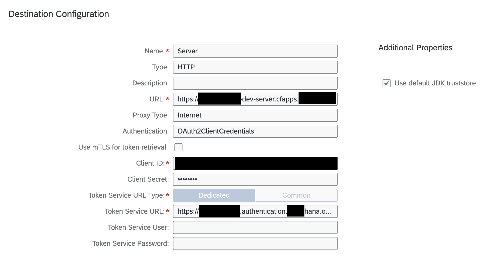

# SAP BTP Destionations - OAuth 2 Client Credentials

## Prerequisites

-   Access to a SAP BTP Subaccount with Cloud Foundry Environment enabled, e.g. a trial instance
    -   https://developers.sap.com/tutorials/hcp-create-trial-account.html
-   node and npm
    -   https://docs.npmjs.com/downloading-and-installing-node-js-and-npm#using-a-node-version-manager-to-install-nodejs-and-npm
-   Cloud Foundry CLI
    -   https://docs.cloudfoundry.org/cf-cli/install-go-cli.html
-   MTA Build Tool CLI
    -   https://help.sap.com/docs/HANA_CLOUD_DATABASE/c2b99f19e9264c4d9ae9221b22f6f589/1412120094534a23b1a894bc498c2767.html#download-and-install-the-mta-build-tool

## Initial setup

`npm run init`

## Login into Cloud Foundry Space

-   In the package.json file, replace \$\{API_ENDPOINT}, \$\{ORG_NAME} and \$\{SPACE_NAME} with actual parameters from your SAP BTP Subaccount. You can find them in the Subaccount Overview in the SAP BTP Cockpit.
-   `npm run cf:login`
-   authenticate with your BTP user

## Deployment of the Server app

-   `npm run build:server`
-   `npm run deploy:server`

## Configure a destination to the server app

-   `cf app server | grep routes`
-   copy the route that should have the following format: XXXXXXeftrial-dev-server.cfapps.XXXX-XXX.hana.ondemand.com
-   Client ID, Client Secret and Token Service URL can be obtained from the service binding. For this, in the BTP Cockpit, navigate to the server application in the dev Cloud Foundry Space, go to "Service Bindings", select xsuaa-service and then click on the button "Show sensitive data"
    
-   In the SAP BTP Cockpit, navigate into your Cloud Foundry Space > Services > Instances > destination-service > Destinations
-   Create a new destination with the following parameters
    -   Name: Server
    -   Type: HTTP
    -   URL: https://${ROUTE_FROM_ABOVE}/server/helloWorldServer()
    -   ProxyType: Internet
    -   Authentication: OAuth2ClientCredentials
    -   Client ID: Server XSUAA Client ID from Service Binding
    -   Client Secret: Server XSUAA Client Secret from Service Binding
    -   Token Service URL: https://XXXXXXXXtrial.authentication.XXXX.hana.ondemand.com/oauth/token (Base URL from url property of the service binding)

## Deployment of the Client app

-   `npm run build:client`
-   `npm run deploy:client`

## Test the destination via your browser

-   `cf app client | grep routes`
-   copy the route that should have the following format: XXXXXXeftrial-dev-server.cfapps.XXXX-XXX.hana.ondemand.com
-   Plain Implementation: open a webbrowser and paste the following URL: ${ROUTE_FROM_ABOVE}/client/helloWorldClientPlain()
-   Cloud SDK Implementation: open a webbrowser and paste the following URL: ${ROUTE_FROM_ABOVE}/client/helloWorldClientCloudSDK()

In both cases, you should see a response like this:

